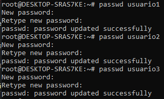
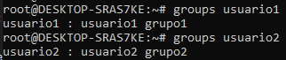

# Actividad #3
### PARTE #1
#### 1. Creación de Usuarios: 
##### - Crea tres usuarios llamados `usuario1`, `usuario2` y `usuario3`.
##### - Utilizamos el comando `sudo -i`para ingresar como usuario root o superusuario con los permisos necesarios para la creación de usuarios.
 

##### - Utilizamos el comando `useradd`, luego el nombre de mi usuario, en este caso usuario1, usuario2 y usuario3.
 

#### 2. Asignación de Contraseñas: 
##### - Establece una nueva contraseñas para cada usuario creado.
##### Con el comando `passwd`, ingresamos nuestra contraseña.
 

#### 3. Información de Usuarios: 
##### - Muestra la información de `usuario1` usando el comando `id`.

 

#### 4. Eliminación de Usuarios: 
##### - Elimina `usuario3`, pero conserva su directorio principal.

##### - Utilizando el comando `userdel` nos permitira eliminar un usuario. Como nota adicional la opción -r indica que también se eliminará su directorio de inicio.

### PARTE #2
#### 1. Creación de Grupos: 
##### - Crea dos grupos llamados `grupo1` y `grupo2`.
##### - Utilizamos el comando `groupadd`, para agregar un nuevo grupo seguido del nombre del grupo.

#### 2. Agregar Usuarios a Grupos: 
##### - Agrega `usuario1` a `grupo1` y `usuario2` a `grupo2`.
##### - Utilizamos el comando `usermod -aG`, seguido del nombre del grupo y nombre del usuario para agregar un usuario a determinado grupo.

#### 3. Verificar Membresía: 
##### - Verifica que los usuarios han sido agregados a los grupos utilizando el comando `groups`.

#### 4. Eliminar Grupo: 
##### - Elimina `grupo2`.
##### - Utilizamos el comando `groupdel`, seguido del nombre del grupo a eliminar. 

