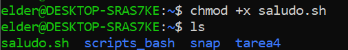
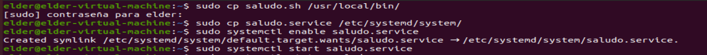
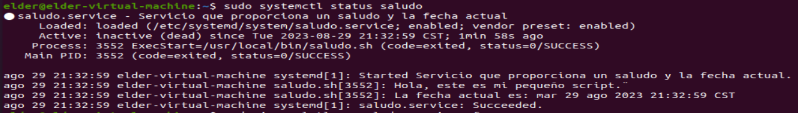

# Actividad #4
## Systemd Unit
#### Pala la presente actividad se tienen dos archivos, el primero un script con el nombre "saludo.sh", el cual tiene como salida un saludo y la fecha actual, mientras que el segundo es un servicio con el nombre "saludo.service", el cual posee la configuracion del servicio.

### - Paso #1
#### Dar permisos al script "saludo.sh" mediante el comando.
`chmod +x saludo.sh`

### - Paso #2
#### Copiar o mover el script "saludo.sh" a la ruta /usr/local/bin/ de la misma forma el servicio "saludo.service" hacia la ruta /etc/systemd/system/
#### Nota: de ser necesario utilizar el comando: `sudo cp miarchivo /colocar/la/ruta/`
 

### - Paso #3
#### Habilitar e iniciar el servicio con los siguientes comandos
`sudo systemctl enable saludo.service`
`sudo systemctl start saludo.service`

### - Paso #4
#### Mostrar el estado y contenido del servicio mediante el comando.
`systemctl status mi_servicio`
